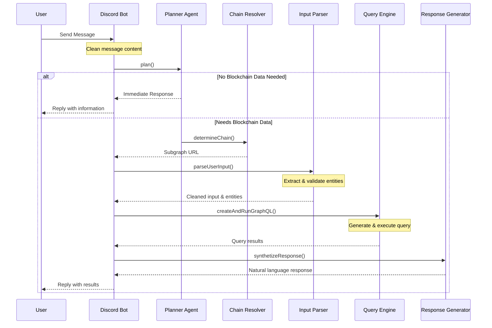
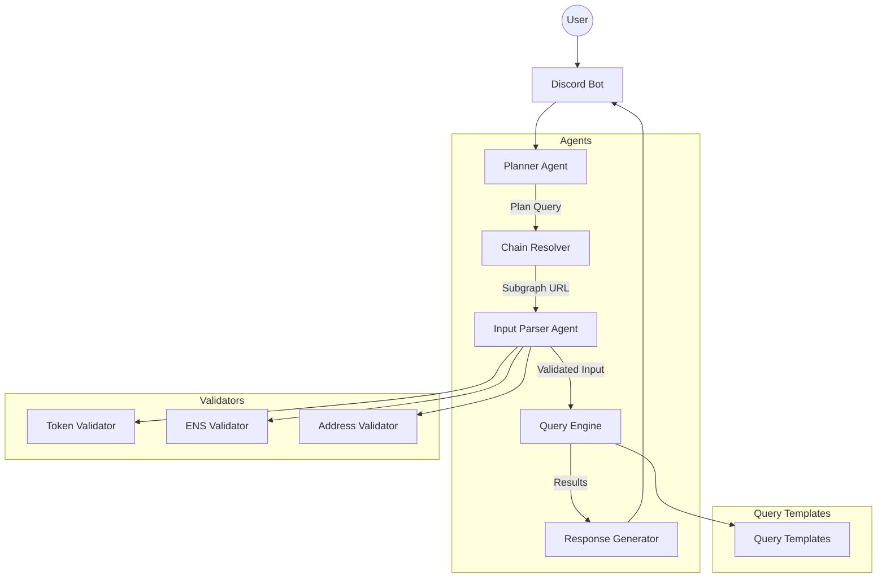
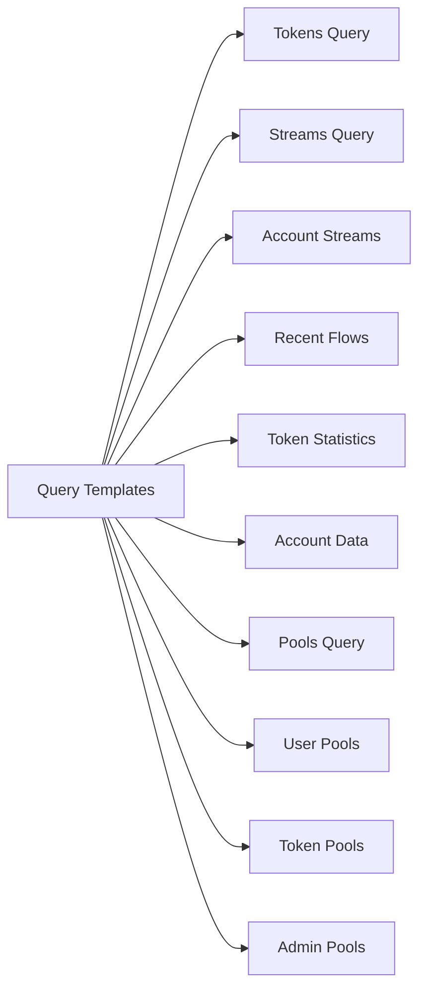
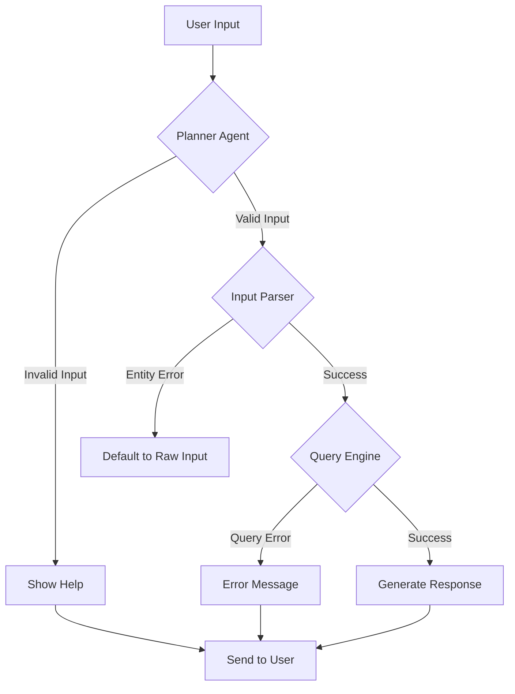

# Streamline Discord Bot Architecture

## Flow Diagram

## Component Diagram

## Agent Responsibilities

### 1. Planner Agent (`plannerAgent.ts`)
- Determines if blockchain data is needed
- Suggests required tools and actions
- Handles help and concept explanations

### 2. Chain Resolver (`determineChain.ts`)
- Identifies appropriate blockchain network
- Provides correct subgraph URL
- Handles chain-specific logic

### 3. Input Parser (`inputParserAgent.ts`)
- Extracts entities (tokens, ENS, addresses)
- Validates and normalizes entities
- Cleans user input

### 4. Query Engine (`createAndRunGraphQL.ts`)
- Selects appropriate query template
- Applies variables to template
- Executes query against subgraph

### 5. Response Generator (`synthetizeResponse.ts`)
- Formats query results
- Generates natural language responses
- Handles error cases

## Query Templates

## Error Handling Flow

